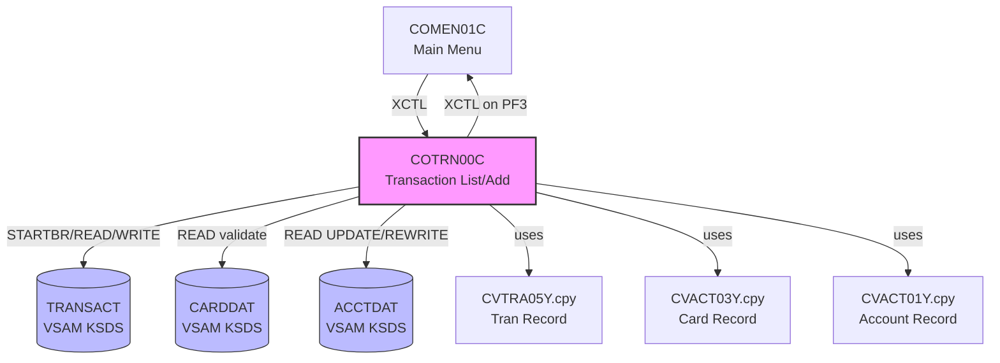

# Reverse Engineering Report: COTRN00C.cbl

## Program Identification

| Field | Value |
|-------|-------|
| Program ID | COTRN00C |
| Program Type | CICS Online (BMS) |
| Description | Transaction Listing and Processing |
| Transaction ID | CTR0 |
| BMS Map | COTRN0A / COTRN0B |
| Copybooks Used | COTRN00.cpy, CVTRA05Y.cpy, CVACT03Y.cpy, CVACT01Y.cpy, COTTL01Y.cpy, CSDAT01Y.cpy, CSMSG01Y.cpy |
| LOC (excluding comments) | ~720 |

## Structural Overview

COTRN00C is the most complex online program in CardDemo. It handles both transaction listing (browsing existing transactions for an account) and new transaction creation (processing debits, credits, payments, and cash advances). The program interacts with multiple VSAM files: TRANSACT for transaction records, CARDDAT for card validation, and ACCTDAT for balance and limit checks.

### Paragraph Structure

| Paragraph | Purpose |
|-----------|---------|
| MAIN-PARA | Entry point, routes based on EIBCALEN and COMMAREA mode |
| PROCESS-ENTER-KEY | Main router: list mode or add mode |
| PROCESS-PAGE-FORWARD | Browse next page of transactions |
| PROCESS-PAGE-BACKWARD | Browse previous page of transactions |
| LIST-TRANSACTIONS | Initiates browse of TRANSACT by account ID |
| STARTBR-TRANSACT-FILE | Positions browse cursor |
| READNEXT-TRANSACT-FILE | Reads next transaction record |
| READPREV-TRANSACT-FILE | Reads previous transaction record |
| ENDBR-TRANSACT-FILE | Ends browse operation |
| POPULATE-TRAN-LINE | Moves transaction fields to map display line |
| PROCESS-ADD-TRANSACTION | Initiates new transaction entry mode |
| VALIDATE-TRANSACTION-DATA | Validates all fields for a new transaction |
| VALIDATE-TRAN-AMOUNT | Checks amount > 0 and within limits |
| VALIDATE-TRAN-TYPE | Checks type code is 01, 02, 03, or 04 |
| VALIDATE-CARD-ACTIVE | Reads CARDDAT to confirm card is active |
| CHECK-CREDIT-LIMIT | Reads ACCTDAT to verify transaction won't exceed limit |
| WRITE-TRANSACTION-RECORD | Writes new transaction to TRANSACT |
| UPDATE-ACCOUNT-BALANCE | Adjusts ACCT-CURR-BAL after posting |
| GENERATE-TRAN-ID | Creates unique transaction ID from sequence |
| SEND-TRAN-SCREEN | Sends BMS map |
| RECEIVE-TRAN-SCREEN | Receives user input |
| FORMAT-AMOUNT-DISPLAY | Formats S9(9)V99 for comma-separated display |
| FORMAT-TRAN-DATE | Formats date and time for display line |
| POPULATE-HEADER-INFO | Header fields |

### Control Flow

```
MAIN-PARA
  |-- (EIBCALEN = 0) --> Initialize, SEND-TRAN-SCREEN
  |-- (EIBCALEN > 0) --> RECEIVE-TRAN-SCREEN
       |-- (AID = ENTER, list mode) --> LIST-TRANSACTIONS
       |    |-- STARTBR-TRANSACT-FILE
       |    |-- Loop: READNEXT x10 --> POPULATE-TRAN-LINE
       |    |-- ENDBR-TRANSACT-FILE
       |    |-- SEND-TRAN-SCREEN
       |-- (AID = ENTER, add mode) --> VALIDATE-TRANSACTION-DATA
       |    |-- VALIDATE-TRAN-AMOUNT
       |    |-- VALIDATE-TRAN-TYPE
       |    |-- VALIDATE-CARD-ACTIVE
       |    |-- CHECK-CREDIT-LIMIT
       |    |-- (all valid) --> GENERATE-TRAN-ID
       |    |    --> WRITE-TRANSACTION-RECORD
       |    |    --> UPDATE-ACCOUNT-BALANCE
       |    |-- (invalid) --> error msg --> SEND-TRAN-SCREEN
       |-- (AID = PF5) --> PROCESS-ADD-TRANSACTION (toggle to add mode)
       |-- (AID = PF7) --> PROCESS-PAGE-BACKWARD
       |-- (AID = PF8) --> PROCESS-PAGE-FORWARD
       |-- (AID = PF3) --> XCTL to COMEN01C
```

## Business Rules

### BR-TRN-001: Transaction Types
- Type 01: Purchase (debit to account, increases balance)
- Type 02: Return (credit to account, decreases balance)
- Type 03: Payment (credit to account, decreases balance)
- Type 04: Cash Advance (debit to account, checked against cash credit limit)
- Any other type code rejected in VALIDATE-TRAN-TYPE

### BR-TRN-002: Amount Validation
- Transaction amount (TRAN-AMT) must be > 0 (strictly positive)
- Amount is PIC S9(9)V99 COMP-3, max value: 999999999.99
- Zero amount rejected: "Transaction amount must be greater than zero"
- Negative amount rejected: "Transaction amount cannot be negative"
- Amounts with more than 2 decimal places rejected at BMS input level

### BR-TRN-003: Credit Limit Check
- For type 01 (Purchase) and 04 (Cash Advance):
  - New balance = ACCT-CURR-BAL + TRAN-AMT
  - If new balance > ACCT-CREDIT-LIMIT: reject with "Transaction would exceed credit limit"
- For type 04 (Cash Advance) additionally:
  - Checked against ACCT-CASH-CREDIT-LIMIT
- Types 02 (Return) and 03 (Payment) bypass credit limit check

### BR-TRN-004: Card Active Check
- VALIDATE-CARD-ACTIVE reads CARDDAT by card number
- Card must have CARD-ACTIVE-STATUS = 'Y'
- Status 'N' or 'R': "Card is not active, transaction rejected"
- Card not found: "Card number not found"

### BR-TRN-005: Account Balance Update
- After successful WRITE to TRANSACT:
  - Type 01, 04: ACCT-CURR-BAL = ACCT-CURR-BAL + TRAN-AMT (debit)
  - Type 02, 03: ACCT-CURR-BAL = ACCT-CURR-BAL - TRAN-AMT (credit)
  - ACCT-CURR-CYC-DEBIT or ACCT-CURR-CYC-CREDIT updated accordingly
- Account REWRITE performed in UPDATE-ACCOUNT-BALANCE paragraph

### BR-TRN-006: Transaction ID Generation
- GENERATE-TRAN-ID creates a unique 16-character transaction ID
- Format: date (8) + sequence (8), e.g., "202603220000001"
- Sequence obtained from a counter record in TRANSACT file
- Collision handling: retry with incremented sequence

### BR-TRN-007: Transaction Listing Pagination
- Page size: 10 records per page (10 display lines on BMS map)
- Browse uses TRANSACT alternate index keyed by account ID + date
- PF8/PF7 for forward/backward pagination
- Display fields per line: Tran ID, Date, Type, Amount, Description

## Data Structure Mapping

| COBOL Field | Copybook | PIC | Java Type | Java Field | Notes |
|-------------|----------|-----|-----------|------------|-------|
| TRAN-ID | CVTRA05Y | X(16) | String | transactionId | Primary key |
| TRAN-CARD-NUM | CVTRA05Y | X(16) | String | cardNumber | Card FK |
| TRAN-TYPE-CD | CVTRA05Y | X(2) | String | transactionType | 01/02/03/04 |
| TRAN-CAT-CD | CVTRA05Y | X(4) | String | categoryCode | Transaction category |
| TRAN-SOURCE | CVTRA05Y | X(10) | String | transactionSource | Source system |
| TRAN-DESC | CVTRA05Y | X(100) | String | description | Free text |
| TRAN-AMT | CVTRA05Y | S9(9)V99 COMP-3 | BigDecimal | amount | Always positive |
| TRAN-MERCHANT-ID | CVTRA05Y | X(9) | String | merchantId | Merchant identifier |
| TRAN-MERCHANT-NAME | CVTRA05Y | X(25) | String | merchantName | Merchant display |
| TRAN-MERCHANT-CITY | CVTRA05Y | X(20) | String | merchantCity | Merchant location |
| TRAN-MERCHANT-ZIP | CVTRA05Y | X(10) | String | merchantZip | Merchant ZIP |
| TRAN-ORIG-TS | CVTRA05Y | X(26) | LocalDateTime | timestamp | ISO timestamp |
| TRAN-PROC-TS | CVTRA05Y | X(26) | LocalDateTime | processedTimestamp | Processing time |
| CDEMO-TRAN-ACCT-ID | COTRN00 | X(11) | String | accountId | COMMAREA filter |
| CDEMO-TRAN-MODE | COTRN00 | X(1) | String | - | L=List, A=Add |

## CICS Commands and File I/O

| Operation | Resource | Key | Condition Handling |
|-----------|----------|-----|-------------------|
| EXEC CICS STARTBR | TRANSACT | TRAN-ID (by acct) | NOTFND: "No transactions" |
| EXEC CICS READNEXT | TRANSACT | - | ENDFILE: partial page |
| EXEC CICS READPREV | TRANSACT | - | ENDFILE: stay on first page |
| EXEC CICS ENDBR | TRANSACT | - | - |
| EXEC CICS WRITE | TRANSACT | TRAN-ID | DUPREC: regenerate ID and retry |
| EXEC CICS READ | CARDDAT | CARD-NUM | NOTFND: "Card not found" |
| EXEC CICS READ UPDATE | ACCTDAT | ACCT-ID | NOTFND/INVREQ: error |
| EXEC CICS REWRITE | ACCTDAT | - | IOERR: ABEND 'TRNU' |
| EXEC CICS SEND MAP | COTRN0A | - | - |
| EXEC CICS RECEIVE MAP | COTRN0A | - | MAPFAIL |

## Dependencies

### Upstream
- **COMEN01C**: Main menu transfers control for transaction operations

### Downstream
- **COMEN01C**: Returns on PF3
- **TRANSACT**: VSAM KSDS (transaction records, read/write)
- **CARDDAT**: VSAM KSDS (card validation, read-only)
- **ACCTDAT**: VSAM KSDS (balance update, read/update/rewrite)

### Copybook Dependencies
- **COTRN00.cpy**: COMMAREA layout
- **CVTRA05Y.cpy**: Transaction record layout
- **CVACT03Y.cpy**: Card record layout (for validation)
- **CVACT01Y.cpy**: Account record layout (for balance update)
- **COTTL01Y.cpy, CSDAT01Y.cpy, CSMSG01Y.cpy**: Standard UI copybooks

## Dependency Diagram



## Migration Recommendations

### Target API
- **List**: GET /api/v1/transactions?accountId={id}&page={n}&size={n}&fromDate={d}&toDate={d}
- **Create**: POST /api/v1/transactions
- **Request (Create)**: `{ "cardNumber": "string", "transactionType": "string", "amount": number, "merchantId": "string", "description": "string" }`

### Transaction Processing
1. **Atomicity**: COBOL performs WRITE(TRANSACT) + REWRITE(ACCTDAT) sequentially. Java must use database transaction (@Transactional) to ensure atomicity.
2. **ID generation**: Replace COBOL sequential counter with UUID or database sequence.
3. **Credit limit check**: Implement as a service-layer validation with SELECT FOR UPDATE on account row.
4. **Idempotency**: Add idempotency key to POST request to prevent duplicate transactions.

### Separation of Concerns
- COBOL combines list and add in one program (mode flag in COMMAREA)
- Java separates into GET (list) and POST (create) on the same resource path
- Validation rules extracted to TransactionValidator service class

### Architecture Decision

| Decision | Choice | Rationale |
|----------|--------|-----------|
| Transaction ID | UUID v7 (time-ordered) | Replaces COBOL date+sequence; globally unique |
| Atomicity | @Transactional + SELECT FOR UPDATE | Ensures balance update consistency |
| Type codes | Enum (PURCHASE, RETURN, PAYMENT, CASH_ADVANCE) | Type-safe, self-documenting |
| Amount handling | BigDecimal, scale 2 | Matches COBOL S9(9)V99 precision |
| Pagination | Offset-based with date range filter | Replaces CICS STARTBR/READNEXT |
| Credit check | Service layer with pessimistic lock on account | Prevents race conditions |
| Idempotency | Client-provided idempotency key header | Not present in COBOL; needed for REST |
